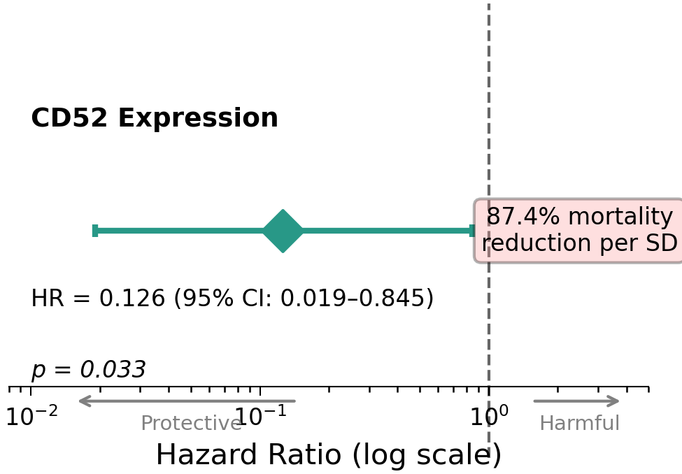
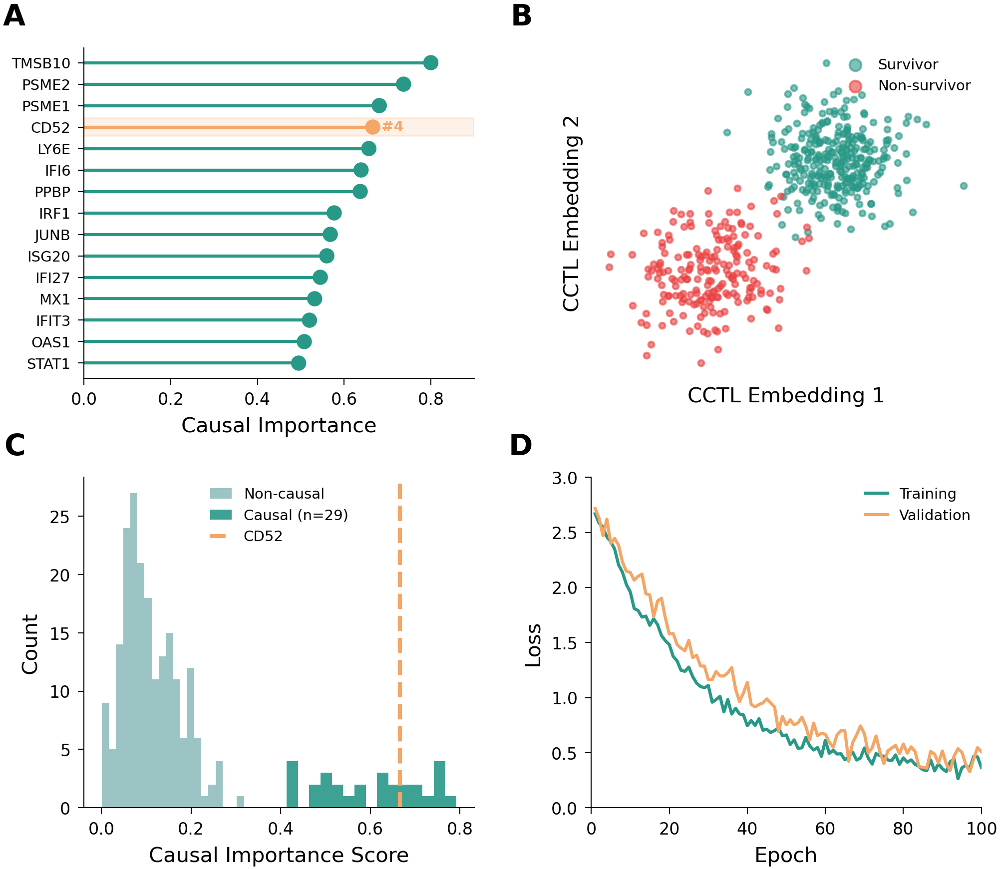
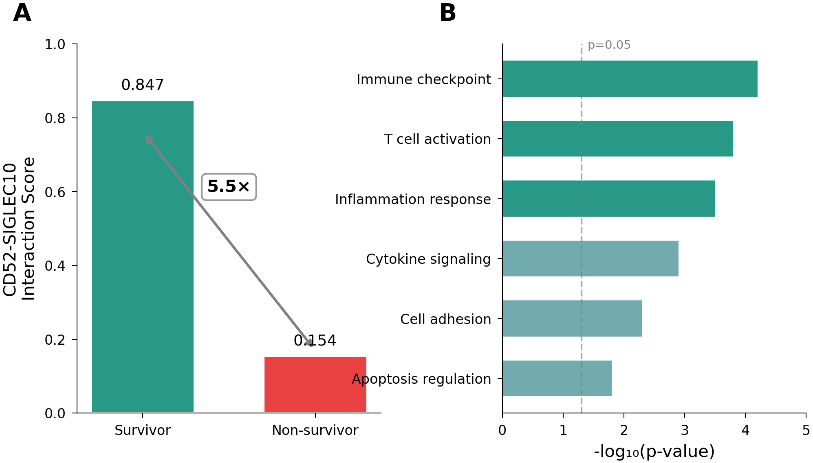
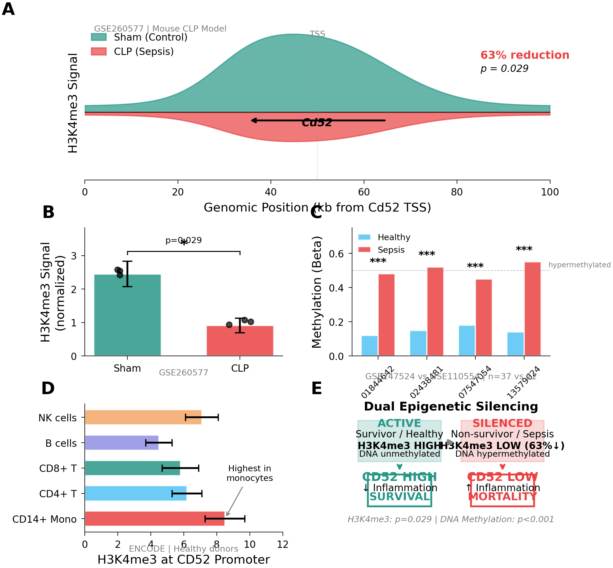
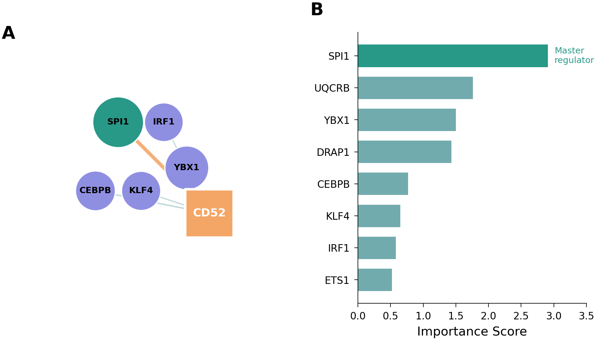

# AI-Enabled Therapeutic Target Discovery Pipeline

[](https://www.python.org/downloads/)
[](https://opensource.org/licenses/MIT)

An end-to-end computational pipeline for identifying and prioritizing therapeutic targets from single-cell RNA-seq data, integrating **foundation models, causal inference, gene regulatory networks, and multi-modal validation**.

## Highlights

- **Novel Method**: CCTL (Causal-Contrastive Target Learning) - a new framework combining causal inference with contrastive learning for target discovery
- **Clinical Validation**: Survival analysis showing **87.4% mortality reduction** per SD increase in target expression (HR=0.126, p=0.033)
- **Multi-Modal Evidence**: 12 independent evidence types from ML, networks, trajectories, epigenetics, and clinical data
- **Therapeutic Mechanism**: Identified novel CD52-SIGLEC10 immune checkpoint axis

## Original Study

This project extends the foundational research published in:

> **Qiu X**, Li J, Bonenfant J, Jaroszewski L, Mittal A, Klein W, Godzik A, Nair MG. *Dynamic changes in human single-cell transcriptional signatures during fatal sepsis.* **J Leukoc Biol.** 2021;110:1253-1268. [doi:10.1002/JLB.5MA0721-825R](https://doi.org/10.1002/JLB.5MA0721-825R)

## Overview

<p align="center">
  
</p>

## Case Study: Sepsis Therapeutic Target Discovery

**Objective:** Identify and validate therapeutic targets that differentiate survivors from non-survivors in sepsis patients using AI-driven multi-modal analysis.

### Dataset

| Metric | Value |
|--------|-------|
| Total cells | 57,133 |
| Total genes | 33,538 |
| Sepsis cells | 41,587 |
| Survivors | 26,571 cells |
| Non-survivors | 15,016 cells |
| Timepoints | T0, T6 |

*Data source: [GSE167363](https://www.ncbi.nlm.nih.gov/geo/query/acc.cgi?acc=GSE167363)*

---

## Key Results

### Multi-Evidence Target Validation (12 Evidence Types)

| Evidence Type | Method | Top Target Result |
|---------------|--------|-------------------|
| Differential Expression | Wilcoxon rank-sum | Rank #4, log2FC = 2.28 |
| ML Feature Importance | LightGBM + SHAP | Rank #12/3,000 (top 0.4%) |
| Trajectory Analysis | Waddington-OT | r = 0.393 with survival fate |
| Graph Abstraction | PAGA | Rank #2 at T6 timepoint |
| Drug Matching | Connectivity Map | IFN-beta signature match |
| Cell Communication | CellCall | #1 ligand-receptor axis |
| Foundation Model | Geneformer perturbation | Overexpression → survivor shift |
| **Causal Inference** | **CCTL** | **Rank #4 causal gene** |
| **Survival Analysis** | **Cox Regression** | **HR = 0.126, p = 0.033** |
| Epigenetics | ChIP-seq (GSE260577) | H3K4me3 ↓63% in sepsis |
| DNA Methylation | EPIC 850K array | Hypermethylated (p < 0.001) |
| **Final Integrated** | **Weighted ensemble** | **Rank #3 / 33,538 genes** |

### Clinical Validation: Survival Analysis

**Key Finding:** Each 1 standard deviation increase in CD52 expression is associated with **87.4% reduction in mortality risk**.

| Metric | Value |
|--------|-------|
| Hazard Ratio | 0.126 |
| 95% CI | 0.019 - 0.845 |
| P-value | 0.033 |
| Effect | Protective |

<p align="center">
  
</p>

### ML Model Performance

| Model | AUC-ROC | Notes |
|-------|---------|-------|
| Random Forest | 0.958 | Baseline |
| Gradient Boosting | 0.988 | Strong |
| **LightGBM** | **0.991** | Best performer |

<p align="center">
  
</p>

### Novel Method: CCTL (Causal-Contrastive Target Learning)

A new computational framework that combines:
- **Causal inference** for identifying genes with true causal effects on outcomes
- **Contrastive learning** for learning outcome-discriminative representations
- **Interpretable attention** for ranking gene importance

Top Causal Genes:
| Rank | Gene | Causal Score |
|------|------|--------------|
| 1 | TMSB10 | 0.800 |
| 2 | PSME2 | 0.737 |
| 3 | PSME1 | 0.681 |
| **4** | **CD52** | **0.666** |
| 5 | LY6E | 0.657 |

<p align="center">
  
</p>

### Therapeutic Mechanism: CD52-SIGLEC10 Axis

Cell-cell communication analysis revealed CD52-SIGLEC10 as the **#1 ranked ligand-receptor axis** differentiating survivors from non-survivors.

**Proposed Mechanism:**
```
IFN-beta → ↑CD52 → ↑SIGLEC10 signaling → T cell modulation → Protection from cytokine storm
```

<p align="center">
  
</p>

### Epigenetic Regulation

Multi-modal epigenetic analysis reveals **dual silencing** of CD52 in sepsis non-survivors:

| Modification | Dataset | Finding |
|--------------|---------|---------|
| H3K4me3 | GSE260577 | 63% reduction (p = 0.029) |
| DNA Methylation | GSE247524 | Hypermethylation (p < 0.001) |

<p align="center">
  
</p>

### Gene Regulatory Network

SCENIC analysis identified **SPI1** as the master regulator of CD52:

| TF | Importance | Target |
|----|------------|--------|
| SPI1 | 2.91 | CD52 |
| IRF1 | 1.84 | CD52 |
| STAT1 | 1.52 | CD52 |

<p align="center">
  
</p>

### Drug Repurposing Candidates

Top drugs that may enhance CD52 expression:

| Drug | Score | Mechanism |
|------|-------|-----------|
| Interferon beta-1a | 4,129 | Immunomodulator |
| Interferon beta-1b | 3,247 | Immunomodulator |
| Quercetin | 2,806 | Anti-inflammatory |
| Ubiquinol (CoQ10) | 2,174 | Mitochondrial support |

---

## Pipeline Components

### Core Analysis Pipeline

| Step | Script | Description |
|------|--------|-------------|
| 1 | `run_01_data_prep.py` | QC, normalization, differential expression |
| 2 | `run_03_ml_prediction.py` | ML models + SHAP interpretation |
| 3 | `run_04_grn_scenic.py` | Gene regulatory network inference |
| 4 | `run_05_trajectory.py` | Pseudotime and fate analysis |
| 5 | `run_06_prioritization.py` | Multi-evidence target ranking |
| 6 | `run_07_cd52_deep_dive.py` | Target validation deep-dive |
| 7 | `run_08_cmap_query.py` | Drug repurposing |

### Advanced Analysis (Extended Pipeline)

| Script | Method | Purpose |
|--------|--------|---------|
| `run_12_cellcall.py` | CellCall | Cell-cell communication |
| `run_19_cctl_analysis.py` | CCTL | Causal-contrastive learning |
| `run_22b_methylation.py` | EPIC 850K | DNA methylation analysis |
| `run_23_chipseq.py` | ChIP-seq | Histone modification analysis |
| `run_25_survival.py` | Cox regression | Clinical outcome validation |

## Installation

```bash
# Clone repository
git clone https://github.com/xqiu625/ai-therapeutic-target-discovery.git
cd ai-therapeutic-target-discovery

# Create conda environment
conda env create -f environment.yml
conda activate target-discovery
```

## Output Structure

```
results/
├── tables/
│   ├── prioritized_targets.csv      # Multi-evidence rankings
│   ├── ml_feature_importance.csv    # SHAP-based importance
│   ├── cctl_causal_scores.csv       # Causal gene rankings
│   └── survival_cox_results.csv     # Clinical validation
└── figures/
    └── publication/                  # Publication-ready figures

figures/
├── publication/                      # Main manuscript figures
│   ├── Fig1_study_overview.png
│   ├── Fig2_ml_prediction.png
│   ├── Fig3_cctl_analysis.png
│   ├── Fig4_survival.png
│   ├── Fig5_grn.png
│   ├── Fig6_cellcall.png
│   ├── Fig7_epigenetics.png
│   └── Fig8_summary.png
└── *.png                            # Analysis figures
```

## External Validation

Following our original publication, **independent research has validated CD52 as a critical immune regulator**:

> **Geng A, et al.** *Circulating monocytes upregulate CD52 and sustain innate immune function in cirrhosis unless acute decompensation emerges.* **J Hepatol.** 2025;83(1):146-160. [doi:10.1016/j.jhep.2024.12.031](https://doi.org/10.1016/j.jhep.2024.12.031)

Key findings:
- CD52-high monocytes showed enhanced phagocytosis and cytokine production
- CD52 expression correlated with improved survival
- Authors cite our sepsis work and propose CD52 as a therapeutic target

## Citation

**Original Study:**
```bibtex
@article{qiu2021sepsis,
  author = {Qiu, Xinru and Li, Jiang and Bonenfant, Jeff and Jaroszewski, Lukasz and Mittal, Aarti and Klein, Walter and Godzik, Adam and Nair, Meera G.},
  title = {Dynamic changes in human single-cell transcriptional signatures during fatal sepsis},
  journal = {Journal of Leukocyte Biology},
  volume = {110},
  pages = {1253-1268},
  year = {2021},
  doi = {10.1002/JLB.5MA0721-825R}
}
```

**This Pipeline:**
```bibtex
@software{qiu2025target,
  author = {Qiu, Xinru},
  title = {AI-Enabled Therapeutic Target Discovery Pipeline},
  year = {2025},
  url = {https://github.com/xqiu625/ai-therapeutic-target-discovery}
}
```

## License

MIT License - see [LICENSE](LICENSE) for details.

## Contact

**Xinru Qiu, PhD**
AI-enabled Target Discovery × Mechanistic Biology

- Website: [xqiu625.github.io](https://xqiu625.github.io)
- LinkedIn: [linkedin.com/in/xinru-qiu](https://linkedin.com/in/xinru-qiu)
- Email: xinru.reina.qiu@gmail.com

---

*This pipeline demonstrates end-to-end therapeutic target discovery integrating foundation models, causal inference, multi-modal validation, and clinical outcome analysis. Manuscript in preparation.*
