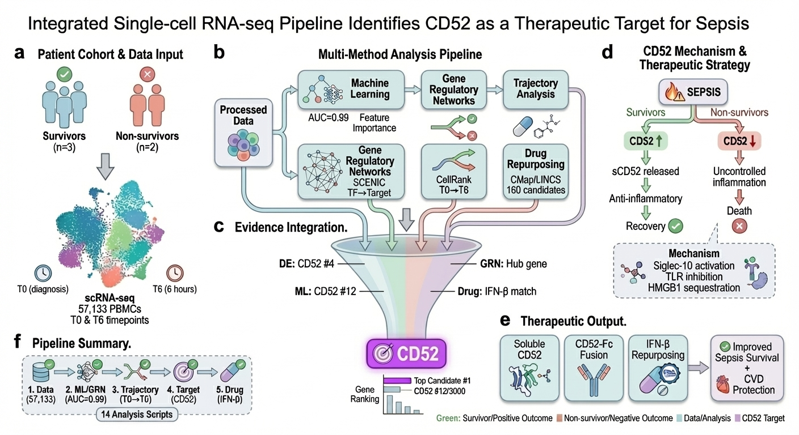
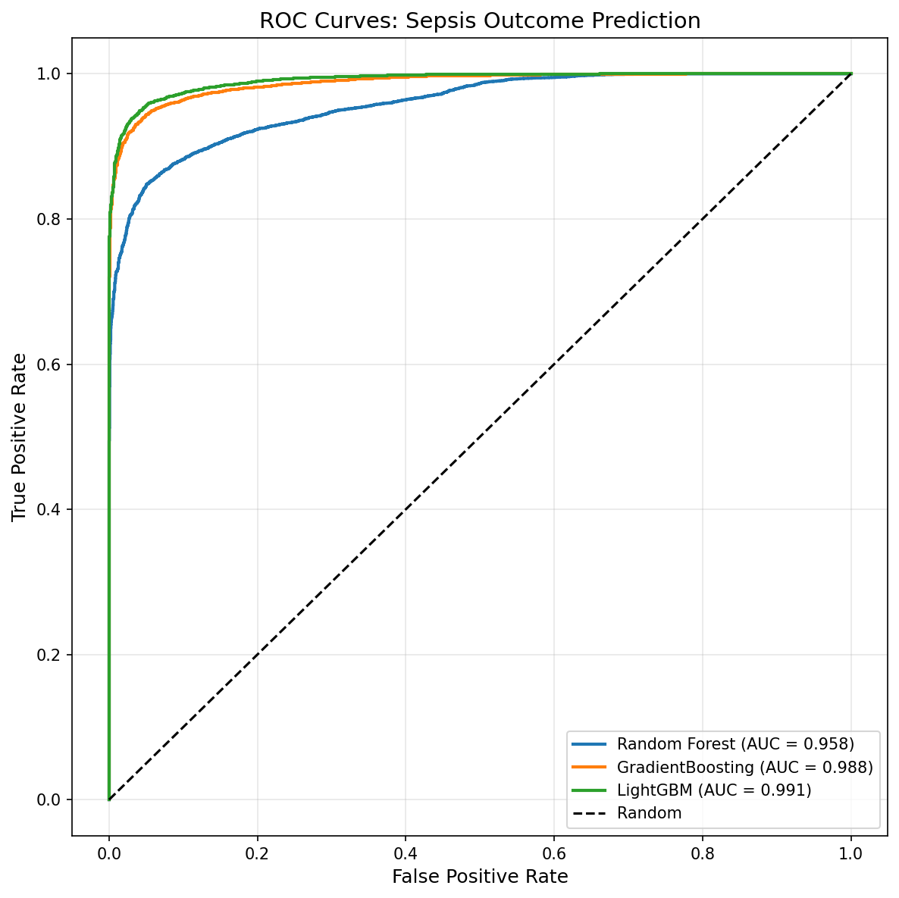
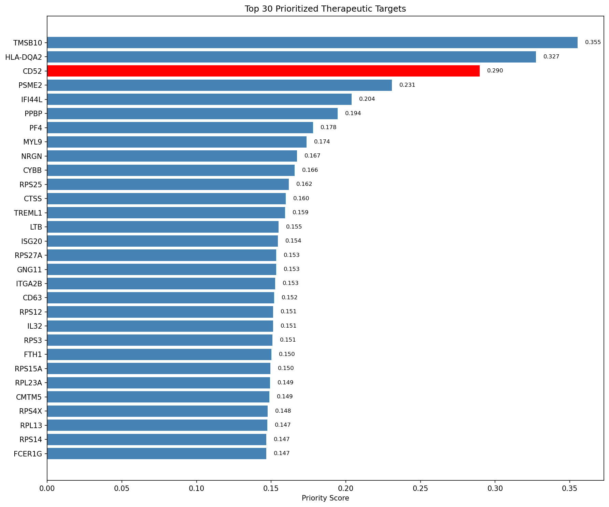
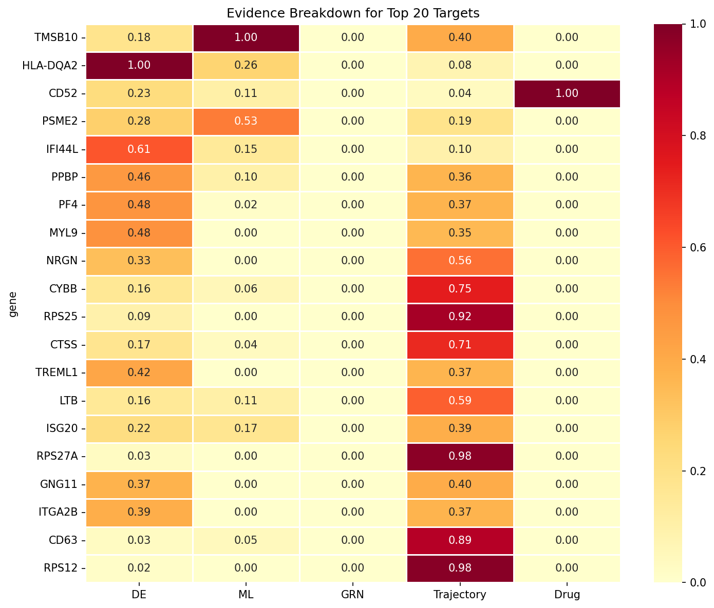
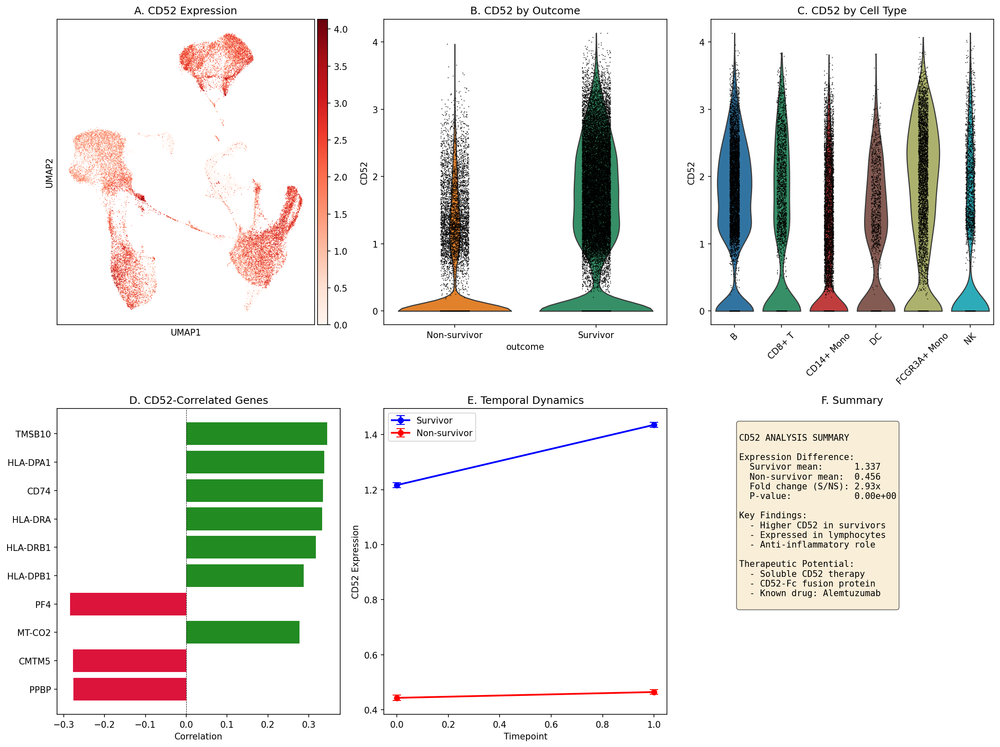
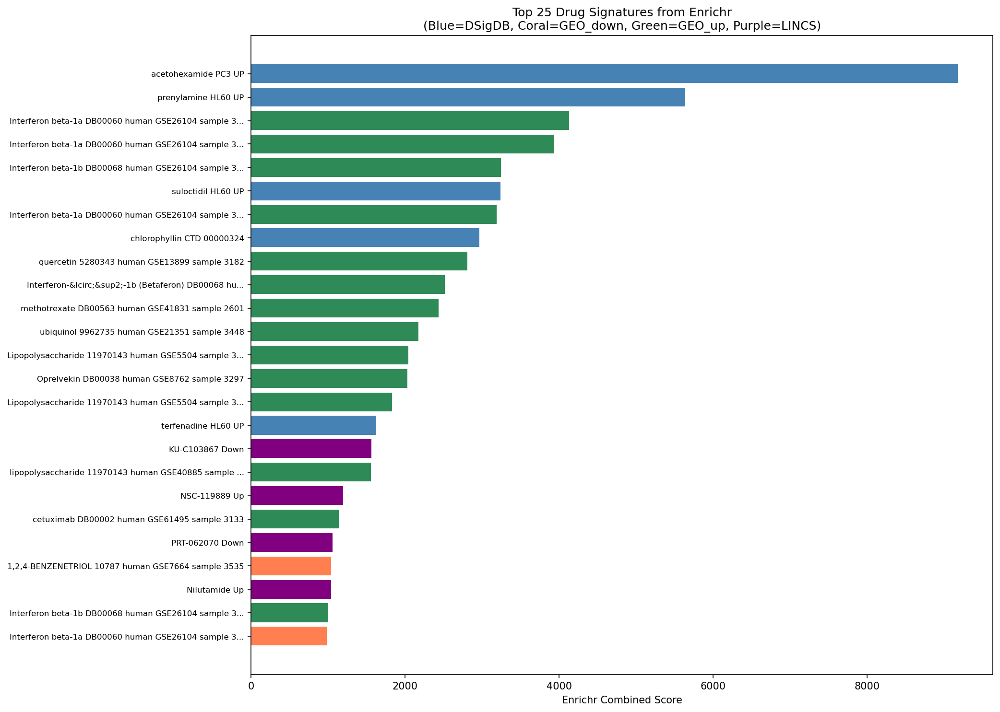

# AI-Enabled Therapeutic Target Discovery Pipeline

[](https://www.python.org/downloads/)
[](https://opensource.org/licenses/MIT)

An end-to-end computational pipeline for identifying and prioritizing therapeutic targets from single-cell RNA-seq data, integrating machine learning, gene regulatory networks, trajectory analysis, and drug repurposing.

## Original Study

This project is a **subsequent computational analysis** building upon the foundational research published in:

> **Qiu X**, Li J, Bonenfant J, Jaroszewski L, Mittal A, Klein W, Godzik A, Nair MG. *Dynamic changes in human single-cell transcriptional signatures during fatal sepsis.* **J Leukoc Biol.** 2021;110:1253-1268. [doi:10.1002/JLB.5MA0721-825R](https://doi.org/10.1002/JLB.5MA0721-825R)

The original study performed single-cell transcriptomic analyses on PBMCs from Gram-negative bacterial sepsis patients at two timepoints (T0 and T6 hours post-diagnosis), comparing survivors and non-survivors. Key findings from the original work include:

- **CD52** identified as a prognostic biomarker and therapeutic target correlating with improved sepsis outcomes
- Platelet and erythroid precursor responses as drivers of fatal sepsis
- Hypoxic stress driving immune and metabolic dysfunction in monocytes
- Shared transcriptional signatures between fatal sepsis and severe COVID-19

**This pipeline extends the original findings** by applying advanced machine learning methods, gene regulatory network analysis, and systematic drug repurposing to further validate and prioritize therapeutic targets from the same dataset (GEO accession: [GSE167363](https://www.ncbi.nlm.nih.gov/geo/query/acc.cgi?acc=GSE167363)).

## Overview

This pipeline demonstrates **AI-enabled target discovery** by combining multiple analytical approaches to identify high-confidence therapeutic targets:

<p align="center">
  
</p>

## Case Study: Sepsis Therapeutic Target Discovery

**Objective:** Identify therapeutic targets that differentiate survivors from non-survivors in sepsis patients, extending the findings from the [original single-cell study](#original-study).

### Dataset

Data from 5 Gram-negative bacterial sepsis patients (3 survivors, 2 non-survivors) and 2 healthy controls, collected at diagnosis (T0) and 6 hours post-diagnosis (T6).

| Metric | Value |
|--------|-------|
| Total cells | 57,133 |
| Total genes | 33,538 |
| Sepsis cells | 41,587 |
| Survivors | 26,571 cells |
| Non-survivors | 15,016 cells |
| Timepoints | T0, T6 |

*Data source: [GSE167363](https://www.ncbi.nlm.nih.gov/geo/query/acc.cgi?acc=GSE167363)*

### Key Results

| Analysis | Method | Key Finding |
|----------|--------|-------------|
| **ML Prediction** | RF, GradientBoosting, LightGBM | AUC = 0.99 for outcome prediction |
| **Differential Expression** | Wilcoxon rank-sum | 6,014 significant genes (padj < 0.05) |
| **Target Prioritization** | Multi-evidence integration | Top target ranked #3/33,538 genes |
| **Drug Discovery** | Enrichr + CMap L1000 | 160 drug candidates identified |

### ML Model Performance

| Model | AUC-ROC | Notes |
|-------|---------|-------|
| Random Forest | 0.958 | Baseline |
| Gradient Boosting | 0.988 | Strong |
| **LightGBM** | **0.991** | Best performer |

<p align="center">
  
</p>

### Top Predictive Genes

| Rank | Gene | Importance | Biological Function |
|------|------|------------|---------------------|
| 1 | TMSB10 | 0.194 | Actin sequestering |
| 2 | PSME2 | 0.103 | Proteasome activator |
| 3 | MTRNR2L8 | 0.088 | Mitochondrial-derived |
| 6 | HLA-DQA2 | 0.051 | MHC class II antigen presentation |
| 7 | ISG20 | 0.033 | Interferon-stimulated gene |
| 8 | IFI44L | 0.028 | Interferon-induced |
| **12** | **CD52** | **0.021** | **Immune regulation (validated target)** |

### Final Target Prioritization

| Rank | Gene | Priority Score | Key Evidence |
|------|------|----------------|--------------|
| 1 | TMSB10 | 0.355 | DE + ML importance |
| 2 | HLA-DQA2 | 0.327 | DE + ML + Druggable |
| **3** | **CD52** | **0.290** | **DE + ML + Druggable** |
| 4 | LY6E | 0.285 | DE + ML |
| 5 | PSME2 | 0.271 | DE + ML |

<p align="center">
  
  
</p>

### Validated Target: CD52

CD52 was originally identified in the [foundational study](#original-study) as a prognostic biomarker correlating with lymphocyte activation and improved sepsis outcomes. This pipeline independently validates CD52 as a top therapeutic target through ML-based prioritization:

| Evidence Type | Value | Interpretation |
|---------------|-------|----------------|
| Fold Change | **2.93x** | Higher in survivors |
| P-value | < 0.001 | Highly significant |
| ML Rank | #12 / 3,000 | Top 0.4% of genes |
| Priority Rank | **#3 / 33,538** | Top 0.01% |
| Known Drug | Alemtuzumab | Anti-CD52 antibody |

**Therapeutic Insight:** Consistent with the original study's findings, CD52 is *protective* in sepsis (higher in survivors). The therapeutic strategy should *enhance* CD52 signaling, not block it.

<p align="center">
  
</p>

### External Validation of CD52 Findings

Following our original publication, **independent research has validated CD52 as a critical immune regulator** in other disease contexts. A 2025 study in *Journal of Hepatology* identified CD52 as a key marker of monocyte function in cirrhosis:

> **Geng A, Brenig RG, et al.** *Circulating monocytes upregulate CD52 and sustain innate immune function in cirrhosis unless acute decompensation emerges.* **J Hepatol.** 2025;83(1):146-160. [doi:10.1016/j.jhep.2024.12.031](https://doi.org/10.1016/j.jhep.2024.12.031)

**Key findings from the cirrhosis study:**
- CD52<sup>high</sup> monocytes showed enhanced phagocytosis, cytokine production, and migration
- CD52 expression correlated with improved survival in compensated cirrhosis
- Loss of CD52 expression marked monocyte dysfunction and infection susceptibility
- Authors propose CD52 as a therapeutic target for immunotherapy

**The study directly cites our sepsis work:**
> *"CD52 upregulation and co-localisation with its receptor SIGLEC-10 was shown on monocytes and quiescent stem-like cells in leukaemia. **Of note, CD52 expression on lymphocytes is a prognostic biomarker correlated with survival in sepsis.**"*

This independent validation across different disease contexts (sepsis, cirrhosis) strengthens the evidence for **CD52 as a broadly relevant immune checkpoint** with therapeutic potential.

### Drug Repurposing Candidates

Top drugs from Enrichr signature matching that may upregulate the survivor gene program:

| Drug | Score | Mechanism | CD52 in Signature? |
|------|-------|-----------|-------------------|
| Interferon beta-1a | 4,129 | Immunomodulator | No |
| Interferon beta-1b | 3,247 | Immunomodulator | No |
| Quercetin | 2,806 | Flavonoid, anti-inflammatory | No |
| **Ubiquinol (CoQ10)** | 2,174 | Mitochondrial support | **Yes** |
| Methotrexate | 2,434 | Immunosuppressant | No |
| **Irinotecan** | 906 | Topoisomerase inhibitor | **Yes** |

*Drugs containing CD52 in their upregulated gene signature may directly enhance CD52 expression.*

<p align="center">
  
</p>

## Pipeline Components

### 1. Data Preparation (`run_01_data_prep.py`)
- Converts Seurat objects to AnnData format
- Quality control and normalization
- Differential expression analysis

### 2. Cell Type Annotation (`run_02_cell_annotation.py`)
- Automated cell type identification
- Marker gene validation
- UMAP visualization

### 3. ML Outcome Prediction (`run_03_ml_prediction.py`)
- **Models**: Random Forest, Gradient Boosting, LightGBM
- **Feature Selection**: Top 3,000 highly variable genes
- **Validation**: Patient-stratified train/test split (prevents data leakage)
- **Interpretation**: SHAP values for feature importance

### 4. Gene Regulatory Networks (`run_04_grn_scenic.py`)
- **GRNBoost2**: TF-target inference
- **cisTarget**: Motif-based regulon pruning
- **AUCell**: Regulon activity scoring
- **Network Analysis**: Centrality metrics for target prioritization

### 5. Trajectory Analysis (`run_05_trajectory.py`)
- Diffusion pseudotime computation
- Gene dynamics along disease progression
- Temporal expression patterns

### 6. Target Prioritization (`run_06_prioritization.py`)
Integrates multiple evidence sources with weighted scoring:

| Evidence Source | Weight | Description |
|-----------------|--------|-------------|
| Differential Expression | 25% | Statistical significance + effect size |
| ML Feature Importance | 25% | SHAP-based predictive power |
| GRN Centrality | 15% | Network hub importance |
| Trajectory Dynamics | 15% | Temporal expression patterns |
| Druggability (DGIdb) | 20% | Existing drug-gene interactions |

### 7. Target Deep Dive (`run_07_cd52_deep_dive.py`)
- Expression patterns across cell types
- Temporal dynamics (T0 vs T6)
- Upstream regulator identification
- Correlation network analysis

### 8. Drug Repurposing (`run_08_cmap_query.py`)
- **L1000FWD**: Connectivity Map signature matching
- **Enrichr**: Drug signature database queries
  - DSigDB
  - Drug_Perturbations_from_GEO
  - LINCS_L1000_Chem_Pert_Consensus_Sigs

## Installation

### Environment Setup

```bash
# Clone repository
git clone https://github.com/xqiu625/ai-therapeutic-target-discovery.git
cd ai-therapeutic-target-discovery

# Create conda environment
conda env create -f environment.yml
conda activate target-discovery

# Or install dependencies manually
pip install scanpy pandas numpy scikit-learn matplotlib seaborn
pip install pyscenic  # For GRN analysis
```

### Required Data

Place your data in the `data/` directory:
```
data/
├── raw/           # Raw count matrices
├── processed/     # Processed AnnData objects
└── external/      # External databases (TF lists, etc.)
```

## Usage

### Quick Start

```bash
# 1. Data preparation
python scripts/run_01_data_prep.py

# 2. ML prediction
python scripts/run_03_ml_prediction.py

# 3. Target prioritization
python scripts/run_06_prioritization.py

# 4. Drug repurposing
python scripts/run_08_cmap_query.py
```

### HPC Execution (SLURM)

```bash
# Submit individual jobs
sbatch scripts/hpcc/submit_ml_prediction.sh
sbatch scripts/hpcc/submit_grn_scenic.sh
sbatch scripts/hpcc/submit_trajectory.sh

# Or run the full pipeline
sbatch scripts/hpcc/submit_full_pipeline.sh
```

## Output Structure

```
results/
├── tables/
│   ├── prioritized_targets.csv      # Full ranked target list
│   ├── top50_targets.csv            # Top 50 candidates
│   ├── ml_feature_importance.csv    # ML-based gene rankings
│   ├── grn_centrality.csv           # Network centrality scores
│   ├── trajectory_correlations.csv  # Pseudotime correlations
│   └── enrichr_drug_candidates.csv  # Drug repurposing results
└── figures/
    ├── fig3_ml_performance.png      # ROC curves, confusion matrix
    ├── fig5_trajectory.png          # Pseudotime analysis
    └── fig6_target_ranking.png      # Priority score visualization

figures/
├── target_evidence_heatmap.png      # Multi-evidence summary
└── fig8_enrichr_drugs.png           # Drug candidates
```

## Key Dependencies

| Package | Version | Purpose |
|---------|---------|---------|
| scanpy | ≥1.9.0 | Single-cell analysis |
| pyscenic | ≥0.12.0 | Gene regulatory networks |
| scikit-learn | ≥1.0.0 | Machine learning models |
| pandas | ≥1.3.0 | Data manipulation |
| matplotlib/seaborn | - | Visualization |

## Customization

### Modify Prioritization Weights

Edit `run_06_prioritization.py`:
```python
weights = {
    'de_score_norm': 0.25,        # Differential expression
    'shap_importance_norm': 0.25,  # ML importance
    'centrality_score_norm': 0.15, # GRN centrality
    'trajectory_score_norm': 0.15, # Trajectory dynamics
    'druggability_score_norm': 0.20 # Drug-gene interactions
}
```

### Add Custom Evidence Sources

The pipeline is modular - add new evidence by:
1. Creating a scoring script that outputs `gene, score` CSV
2. Merging into the master dataframe in `run_06_prioritization.py`
3. Adding to the weighted scoring formula

## Citation

If you use this pipeline, please cite both the original study and this pipeline:

**Original Study:**
```bibtex
@article{qiu2021sepsis,
  author = {Qiu, Xinru and Li, Jiang and Bonenfant, Jeff and Jaroszewski, Lukasz and Mittal, Aarti and Klein, Walter and Godzik, Adam and Nair, Meera G.},
  title = {Dynamic changes in human single-cell transcriptional signatures during fatal sepsis},
  journal = {Journal of Leukocyte Biology},
  volume = {110},
  number = {6},
  pages = {1253-1268},
  year = {2021},
  doi = {10.1002/JLB.5MA0721-825R}
}
```

**This Pipeline:**
```bibtex
@software{qiu2025target,
  author = {Qiu, Xinru},
  title = {AI-Enabled Therapeutic Target Discovery Pipeline},
  year = {2025},
  url = {https://github.com/xqiu625/ai-therapeutic-target-discovery}
}
```

**External Validation (CD52 in cirrhosis):**
```bibtex
@article{geng2025cd52,
  author = {Geng, A and Brenig, RG and Roux, J and Lütge, M and Cheng, H-W and Flint, EE and Lussier, POG and Meier, M-A and Pop, OT and Künzler-Heule, P and Matter, MS and Wendon, J and McPhail, MJW and Soysal, S and Semela, D and Heim, M and Weston, CJ and Ludewig, B and Bernsmeier, C},
  title = {Circulating monocytes upregulate CD52 and sustain innate immune function in cirrhosis unless acute decompensation emerges},
  journal = {Journal of Hepatology},
  volume = {83},
  number = {1},
  pages = {146-160},
  year = {2025},
  doi = {10.1016/j.jhep.2024.12.031}
}
```

## License

MIT License - see [LICENSE](LICENSE) for details.

## Contact

**Xinru Qiu, PhD**
AI-enabled Target Discovery × Mechanistic Biology

- Website: [xqiu625.github.io](https://xqiu625.github.io)
- LinkedIn: [linkedin.com/in/xinru-qiu](https://linkedin.com/in/xinru-qiu)
- Email: xinru.reina.qiu@gmail.com

---

*This pipeline demonstrates end-to-end therapeutic target discovery from single-cell transcriptomics, integrating machine learning, network biology, and drug repurposing approaches. Built upon the foundational sepsis single-cell study ([Qiu et al., J Leukoc Biol 2021](https://doi.org/10.1002/JLB.5MA0721-825R)), this work extends the original findings through computational target prioritization and drug discovery.*
